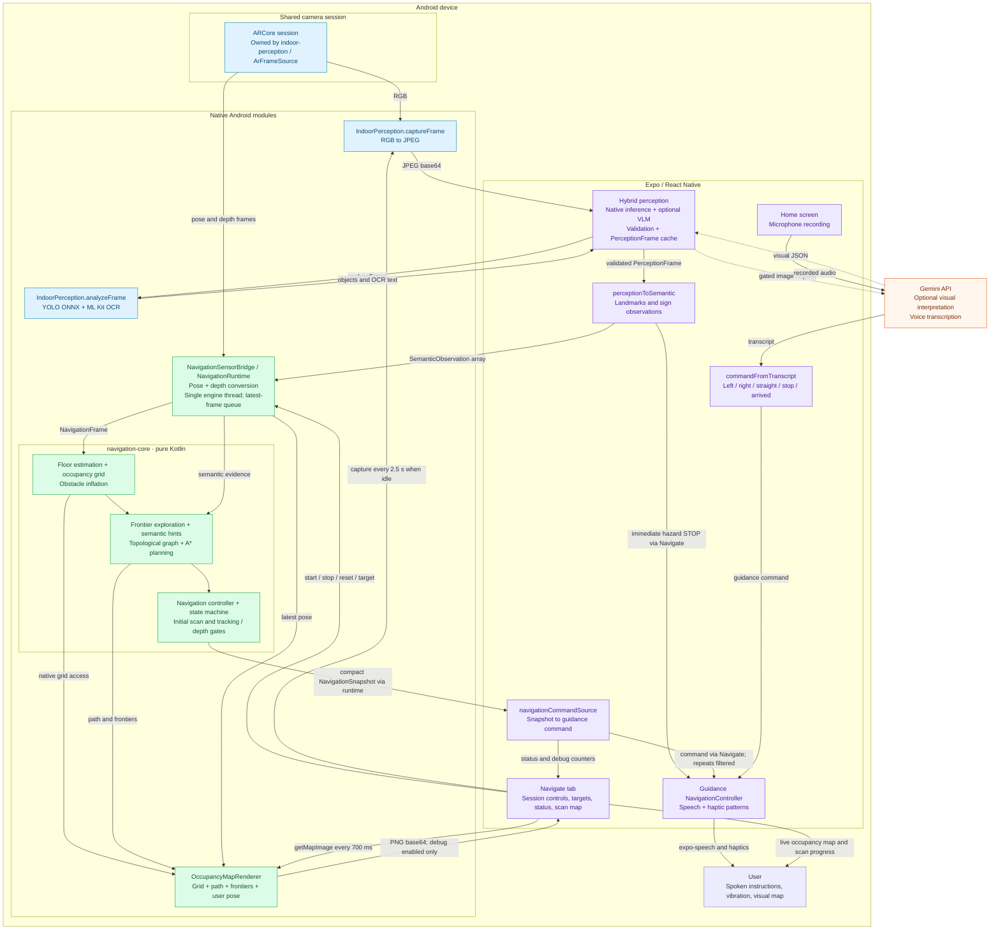

# Project architecture

Architecture of the implementation at `b91d6ec`, including the live scan map. The integrated navigation flow runs on Android; the shared navigation core is pure Kotlin.

## Boundaries and behavior

- **One ARCore session:** `indoor-perception` owns the camera in the Navigate flow and forwards native frames through `NavigationSensorBridge`. The engine-debug screen has an alternative navigation-owned session for isolated testing.
- **Mapping stays native:** depth clouds and occupancy grids do not cross into JavaScript. Navigation emits small snapshots, normally throttled to roughly eight per second, with immediate updates on command or status changes.
- **Perception is slower:** Navigate attempts capture every 2.5 seconds and skips overlapping work. Native YOLO and OCR run before optional Gemini interpretation; visual results become semantic hints and hazard alerts.
- **Navigation gates movement:** the default initial scan is 10 seconds of qualifying scan time. Tracking, depth, map confidence, and route checks can keep movement blocked longer.
- **The map is a preview:** a native renderer reads the engine's grid, path, frontiers, goal, and pose on the engine thread. Navigate requests its PNG every 700 ms while running, with overlapping requests skipped. Debug mode is enabled by this screen and required by the renderer API.
- **Voice is a separate flow:** Home records audio, asks Gemini for a transcript, and maps recognized command words directly to speech and haptics. It does not currently set a navigation destination.
- **Cloud boundary:** this flow calls Gemini directly from the app. Mapping and planning have no Gemini dependency; visual interpretation is gated and optional, while Home's transcription uses Gemini.

## Source map

| Responsibility | Entry point |
| --- | --- |
| Navigate orchestration and scan-map display | [`navigate.tsx`](my-app/src/app/navigate.tsx) |
| ARCore camera ownership and frame sharing | [`ArFrameSource.kt`](my-app/modules/indoor-perception/android/src/main/java/expo/modules/indoorperception/ArFrameSource.kt) |
| Hybrid perception and VLM gate | [`hybridPerception.js`](my-app/src/services/hybridPerception.js) |
| Perception-to-navigation conversion | [`perceptionToSemantic.ts`](my-app/src/perception/perceptionToSemantic.ts) |
| Threading, frame conversion, and native bridge runtime | [`NavigationRuntime.kt`](my-app/modules/navigation-native/android/src/main/java/expo/modules/navigationnative/NavigationRuntime.kt) |
| Mapping, exploration, planning, and control | [`NavigationEngine.kt`](my-app/navigation-core/src/main/kotlin/com/navassist/navcore/NavigationEngine.kt) |
| Native map image | [`OccupancyMapRenderer.kt`](my-app/modules/navigation-native/android/src/main/java/expo/modules/navigationnative/platform/OccupancyMapRenderer.kt) |
| Snapshot-to-guidance adapter | [`navigationCommandSource.ts`](my-app/src/guidance/navigationCommandSource.ts) |
| Speech and haptic output | [`NavigationController.ts`](my-app/src/guidance/NavigationController.ts) |
| Home voice transcription | [`GeminiSpeechService.ts`](my-app/src/ai/GeminiSpeechService.ts) |

This documents source-code wiring, not a new verification of behavior on a physical phone.
