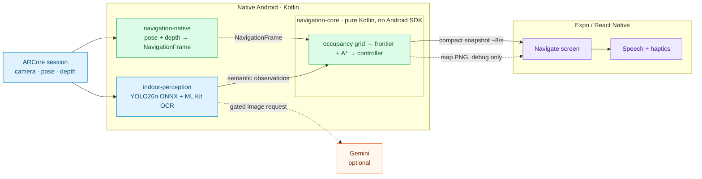

# Navigation Assistant for Visually Impaired

An Android app that walks a blind or low-vision user through an indoor space it has never seen —
no floor plan, no beacons, no installed hardware. It maps the space with ARCore depth, reads signs
and obstacles with an on-device detector, and speaks or vibrates **one instruction at a time**.

**Docs:** [ARCHITECTURE.md](./ARCHITECTURE.md) (full diagram) ·
[TECHNICAL.md](./TECHNICAL.md) (technical reference) ·
[DEMO.md](./DEMO.md) (build and demo) ·
[my-app/docs/](./my-app/docs/) (documentation map)

## Architecture



Three boundaries define the design:

- **Mapping stays native.** Depth clouds and the occupancy grid never cross the bridge — only
  small snapshots, plus a rendered PNG when the debug map is on.
- **The engine is pure Kotlin.** `navigation-core` has no Android SDK or ARCore on its classpath,
  so it is testable on a laptop and portable to iOS unchanged.
- **The cloud is optional.** Mapping and planning have no Gemini dependency; visual interpretation
  is gated, and the app degrades to on-device perception without a key.

Perception runs a **YOLO26n** fine-tuned on 17 indoor wayfinding classes (doors, exit signs,
lifts, arrows) — mAP50 0.833 on its validation split. COCO has none of those labels, which is why
fine-tuning is what makes the semantic half work at all; see [TECHNICAL.md §4.1](./TECHNICAL.md).

## Layout

| Path | What it is |
| --- | --- |
| `my-app/src/` | Expo / React Native app: screens, guidance output, the JS perception stack |
| `my-app/modules/indoor-perception/` | Native module: owns the ARCore session, runs YOLO + ML Kit OCR |
| `my-app/modules/navigation-native/` | Native module: ARCore pose and depth into the navigation engine |
| `my-app/navigation-core/` | The navigation engine. Pure Kotlin, no Android or ARCore on its classpath |
| `my-app/test/` | Offline test suite (`npm test`) |
| `my-app/scripts/` | Diagnostics that need a network, a key or a device. Never run by CI |
| `my-app/snapshots/` | Recorded diagnostic output. Not test fixtures |

`navigation-core` is deliberately a separate Gradle project with no Android SDK. An accidental
`import com.google.ar.core.*` in the engine fails its build rather than going unnoticed — see
[`modules/navigation-native/android/build.gradle`](./my-app/modules/navigation-native/android/build.gradle).

## Getting started

```bash
cd my-app
npm install
cp .env.example .env     # then add a Gemini key if you want the cloud perception path
npm run android          # dev build required; Expo Go cannot load the native modules
```

Navigation needs an ARCore device with Depth API support. Perception alone runs on any Android
device once the dev build is installed.

## Checks

```bash
cd my-app
npm run verify      # lint + type-check + offline tests. This is what CI runs.
npm test            # offline suite on its own
npm run typecheck   # app and Node tooling, separately
npm run test:core   # the Kotlin navigation engine (needs JDK 21 on PATH)
```

`npm test` never touches the network, a Gemini key or a device. The things that do live under
`my-app/scripts/` and are run by hand — see `package.json` for the `probe:`, `profile:`,
`report:` and `audit:` scripts.

## Security

- `.env` is gitignored at both the repo root and in `my-app/`, along with keys, live captures and
  build caches. Copy `my-app/.env.example` and never commit a real key.
- `npm run audit:security` checks the guardrails that can be checked automatically.
- `EXPO_PUBLIC_GEMINI_API_KEY` is compiled into the bundle and **can be extracted from the APK**.
  Acceptable for development and demos; a release would need the Gemini call behind a server.
